I recently got an Apple Watch Ultra and tried my semi-annual (never successful) "use only my watch for a day" challenge. I haven't yet found a watch app that allows realtime conversations with an AI assistant, official or otherwise. I wanted something that could check my tasks, read my emails, and interact with my GitHub stuff from my watch.

So, I built one in less than a day using Twilio, GPT-5 Realtime, and Zapier's MCP server. The code is [open source at oldsj/assistant](https://github.com/oldsj/assistant).

## Requirements

For the task manager specifically, I needed:

1. A solid Apple Watch app with complications (so my next task shows on the watch face)
2. An API for a composable AI assistant

Most task managers fail on one or both, it's rare to find good watch support and an API. Todoist has both. TickTick (ticktick.com) was a decent runner-up with a good watch app and API, but Todoist's existing integration with Zapier made it easy. TickTick wasn't in Zapier and didn't have an official MCP server.

For the assistant itself, I needed realtime voice support and MCP integration so I could add new services easily.

The UX is simple: I added a contact called "🤖 Assistant" with a robot emoji avatar, put it as a complication on my watch face, and now I can tap it or tell Siri "call Assistant" whenever I need something.

## How it works

The stack:

- **Twilio** handles inbound calls via WebSockets
- **GPT-5 Realtime** for voice conversations
- **Zapier MCP** (mcp.zapier.com) for integrations
- **Fly.io** hosting
- Phone number verification in Twilio so only my number can call it

Zapier has an MCP server at mcp.zapier.com that handles integrations. I added Todoist, Gmail, and GitHub through their dashboard instead of having to find or build individual MCP servers for each service.

```mermaid
flowchart LR
    A[🌎 Apple Watch]
    B[📞 Twilio]
    C[🤖 Fly.io Bot]
    D[🧠 GPT-5 Realtime]
    E[🔌 Zapier MCP]
    F[✅ Todoist]
    G[📧 Gmail]
    H[💻 GitHub]

    A -->|Call| B
    B <-->|WebSocket| C
    C <-->|Voice| D
    D -->|MCP| E
    E --> F & G & H
    F -.->|Updates| A

    style A fill:#34495e,stroke:#2c3e50,color:#fff
    style B fill:#9b59b6,stroke:#8e44ad,color:#fff
    style C fill:#3498db,stroke:#2980b9,color:#fff
    style D fill:#e74c3c,stroke:#c0392b,color:#fff
    style E fill:#f39c12,stroke:#d68910,color:#fff
    style F fill:#2ecc71,stroke:#27ae60,color:#fff
    style G fill:#2ecc71,stroke:#27ae60,color:#fff
    style H fill:#2ecc71,stroke:#27ae60,color:#fff
```

## What it can do

Right now it's mostly conversational task management. I can create tasks, edit them, add descriptions and priorities, move things between projects. All hands-free and at the speed of speech. 

The nice part is my watch face updates in real time with the next available task I should be working on. So I'll tell the assistant "add a task to review the authentication PR, high priority, due today" and a few seconds later my watch face updates to show that task if it's next up.

I can also check my email and ask about GitHub repos, though I use those less than the task management so far.

## A few technical notes

**Cost:** It's extremely cheap to run. Fly.io has a generous free tier for low-spec servers, Twilio charges a low rate per minute for calls, and GPT-5 Realtime API calls are brief and cheap for this use case.

**Authentication:** On the Twilio platform there's a function that checks the inbound phone number. If it's allowed, it makes a call to my Fly.io bot, which validates the request came from Twilio using signature verification. The Zapier integrations handle their own OAuth when you set them up.

**Interruptions:** I initially used loudness-based interruption detection and it was terrible. Background noise would make it pause mid-sentence constantly. Switched to semantic-based detection using OpenAI's `semantic_vad` turn detection type ([docs here](https://platform.openai.com/docs/guides/realtime-vad)) and that fixed it completely.

**Latency:** There are noticeable pauses when it accesses MCP tools (checking Todoist, reading Gmail, querying GitHub). But the conversation still feels natural enough.

**Development:** Building this with Claude Code made it fast. Going from idea to working prototype in under a day would have been much harder otherwise.

## What I want to add next

**Knowledge base:** I want to hook up an Obsidian vault or something similar so it has context from my notes and can update them. The idea is to be able to say "remind me what I decided about the design system refactor" or "add this to my product principles note."

**Proactive calls:** Right now I call it, but I also want it to be able to call me. Morning briefings would be useful: weather, calendar, overnight emails, top tasks, GitHub notifications, anything time-sensitive. The infrastructure is straightforward (Twilio outbound calls) but figuring out when to call and how much detail to include is the interesting part.

Other ideas: deadline reminders, meeting prep calls, daily wrap-ups. Not sure which of these would actually be useful versus annoying yet.

## Why I'm excited

I can literally call an AI assistant and have a normal conversation to plan out my day and manage projects. It has Git context, can check my email, and my watch face automatically updates in response to changes. All from my wrist.

The infrastructure for building this is finally straightforward enough that going from idea to working prototype took less than a day. Zapier MCP makes adding new integrations super easy. GPT-5 Realtime handles the conversation. Twilio and Fly.io handle the plumbing.

The code is at [github.com/oldsj/assistant](https://github.com/oldsj/assistant) if you want to see how it works.
